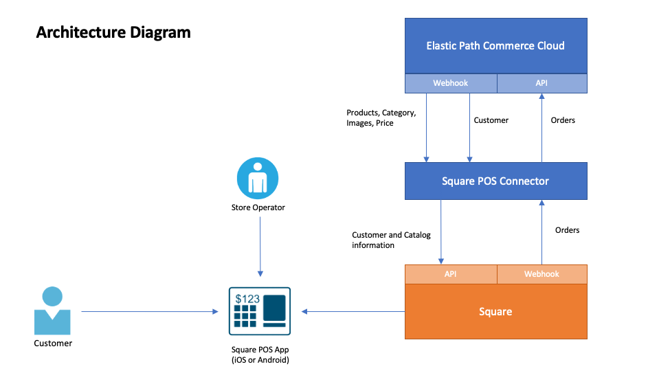
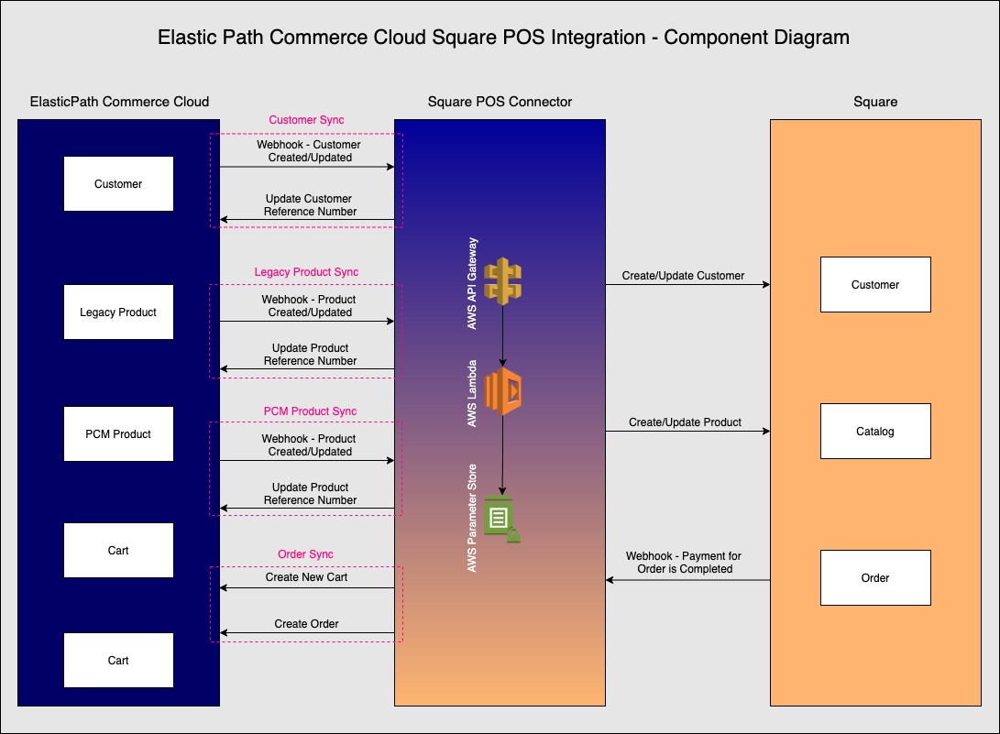

# Square POS Connector

[](https://www.gnu.org/licenses/gpl-3.0)
[](https://twitter.com/intent/follow?screen_name=elasticpath)

## Overview

This connector is created to sync various Elastic Path Commerce Cloud data with Square e.g. Product, Customer, Product Images, Price etc. These items are sellable using Square POS iOS/Android app after data is available in Square.

Connector uses the [Elastic Path Commerce Cloud JavaScript SDK](https://github.com/moltin/js-sdk) for all Elastic Path Commerce Cloud API requests and uses [Square SDK Node.js](https://developer.squareup.com/docs/sdks/nodejs) for connecting with Square.

## Requirement

In Scope                                                            | Out Of Scope
------------                                                        | -------------
Legacy Product sync from EPCC to Square POS (with variant and without variant)                                                            | Inventory sync
Legacy Product Images and Price sync                                | Promotions sync
PCM Product sync from EPCC to Square POS                                                                 |
PCM Product Images and Price sync                                   |
Customer sync from EPCC to Square POS                               |
Order sync from Square POS to EPCC                                  | 


## Skills/Resource Requirement

- Following skills are required to run this asset and then integrate as per your requirement:
  - Backend Developer
    - This project is built on NodeJS and on AWS Cloud.
    - If any changes are required in business logic then backend developer is required.
  - DevOps
    - Deployment, CI/CD needs to be manage by DevOps team.
  - Product Merchandiser
    - Product merchandiser is responsible for adding new product, images, prices etc.

## Prerequisite

### Credentials

- You should have EPCC Client ID and Client secret.
- You should have Square Production Credentials. Please note that Square app only runs on Production instance and does not work with Sandbox instance.

### AWS Parameter Store

Setup following values in AWS Parameter Store under Systems Manager.

Parameter Name                                      | Parameter Value
------------                                        | -------------
/square-pos/<ENVIRONMENT_NAME>/epcc_host            | Use api.moltin.com for EU or use useast.api.elasticpath.com for US.
/square-pos/<ENVIRONMENT_NAME>/epcc_client_id       | <EPCC_CLIENT_ID>
/square-pos/<ENVIRONMENT_NAME>/epcc_client_secret   | <EPCC_CLIENT_SECRET>
/square-pos/<ENVIRONMENT_NAME>/square_access_token  | <SQUARE_ACCESS_TOKEN>
/square-pos/<ENVIRONMENT_NAME>/log_level            | info, debug etc.
/square-pos/<ENVIRONMENT_NAME>/default_currency     | GBP, USD, EUR etc.
/square-pos/<ENVIRONMENT_NAME>/api_key              | Create custom API Key and try to keep length between 32 character to 40 character.
/square-pos/<ENVIRONMENT_NAME>/enable_custom_domain | Keep this value as `true` only if you want to have custom domain, please refer `Setup domain for Serverless function` section. Else give value as `false`
/square-pos/<ENVIRONMENT_NAME>/tag                  | If you want to load data from specific catalog based on the catalog rule then provide tag value, otherwise don't create this property.
/square-pos/<ENVIRONMENT_NAME>/channel              | If you want to load data from specific catalog based on the catalog rule then provide channel value, otherwise don't create this property.
/square-pos/<ENVIRONMENT_NAME>/language             | If you want to load product based on specific locale then use this property. E.g. for French use `fr`, for Japanese use `jp` etc.
/square-pos/<ENVIRONMENT_NAME>/enable_pcm_product_full_sync | Keep this value as `true` if you want to enable full product sync for PCM, else keep it as `false`
/square-pos/<ENVIRONMENT_NAME>/pcm_full_sync_scheduler | Scheduler for PCM Product sync. Syntax is `rate(2 hours)` or `rate(10 minutes)`, you can give time as per your requirement. For more information read [Serverless Framework schedule documentation](https://www.serverless.com/framework/docs/providers/aws/events/schedule/)

### Create Flow

There are few fields added in Product, Order and Customer data model using Flow. If you are running this service using serverless framework then all the flows and fields will be created by the script i.e. `bootstrap/setup.sh` which will invoke following scripts:

- `bootstrap/create-flow-legacy-product.sh`
- `bootstrap/create-flow-customer.sh`
- `bootstrap/create-flow-order.sh`
- `bootstrap/create-template-pcm-product.sh`

If you want to invoke this script manually then use following command from linux or Mac OS:

`sh bootstrap/setup.sh <EPCC_HOST> <EPCC_CLIENT_ID> <EPCC_CLIENT_SECRET>`

## Technical Documentation

### API Endpoint
Following APIs are exposed which needs to be added in Elastic Path Commerce Cloud webhook settings.
- `POST` /v1/product
  - This API endpoint needs to be use for Legacy Product.
- `POST` /v1/customer
  - Customer sync needs to be done using this API endpoint.
- `POST` /v2/product
  - This API endpoint needs to be use for PCM Products.
- `POST` /v1/order
  - This API endpoint needs to be use to sync Square order to Elastic Path Commerce Cloud.

<u><b>Note:</b></u> Make sure to give `Secret Key` value in the Elastic Path Commerce Cloud integration settings same as defined value of `/square-pos/<ENVIRONMENT_NAME>/api_key` in the parameter stores. This will make sure only request is coming from specific servers who knows API key.

### Handle Infinite Loop
Square is having limitation that to update any item in Square you need to have Square reference ID, so let say when a new product is created then webhook event will be trigger to this connector and this product will be created in Square and in response we will get Square reference ID which needs to be updated in Elastic Path Commerce Cloud. Now webhook event will again trigger because same product is updated in Elastic Path Commerce Cloud. If we follow above process then this flow will keep running infinitely. To stop this loop, whenever we receive any request to connector then we will retrieve information from Square and will check if there is any update required. If there is no change then connector will not update Square.

### Architecture Diagram



### Component Diagram



### Environment variables

All these environment variables are defined in serverless yaml configuration.

- EPCC_CLIENT_ID
- EPCC_CLIENT_SECRET
- EPCC_HOST
- SQUARE_ACCESS_TOKEN
- LOG_LEVEL
- DEFAULT_CURRENCY
- SQUARE_ENVIRONMENT
- ENABLED_CUSTOM_DOMAIN_SETUP
- EP_CONTEXT_TAG
- EP_CHANNEL
- ACCEPT_LANGUAGE
- ENABLED_PCM_PRODUCT_FULL_SYNC
- PCM_FULL_SYNC_SCHEDULER

## Setup domain for Serverless function

Following snippet is used in `serverless.yml` file where domain name will be configured while deploying the serverless function to AWS Lambda and AWS API Gateway so that random URL will not be generated. This configuration needs to be change as per your domain.

If you are not planning to use any domain then please remove this section from serverless.yml file before deploying to any environment.

```
domains:
    prod: api.elasticpath.services
    test: api-test.elasticpath.services
    dev: api-dev.elasticpath.services
  hostedZone:
    name: elasticpath.services.
  customDomain:
    domainName: ${self:custom.domains.${self:provider.stage}}
    basePath: 'square-pos-connector'
    stage: ${self:provider.stage}
    createRoute53Record: true
```

Base URL will be generated as follows if above mentioned configuration is used for `prod` environment:

> `https://api.elasticpath.services/square-pos-connector`

## Running Locally or deploy in AWS

- <b>NodeJS + Serverless</b>
  - Install Serverless framework
  - Add AWS credentials in your system
  - Run `npn install`
  - Run `sls offline` to run serverless function in your local environment.
  - This will the server locally on http://localhost:3032 and you try calling APIs using postman.
  - Please note that serverless framework will still call AWS SSM to retrieve Parameter Store values which are defined in serverless configuration.
  - Run `sls deploy --stage=<ENVIRONMENT_NAME>` to deploy serverless into AWS from your system.

## Terms And Conditions

- For more information about the license, see [GPLv3 License](https://github.com/elasticpath/epcc-react-pwa-reference-storefront/blob/master/LICENSE).
